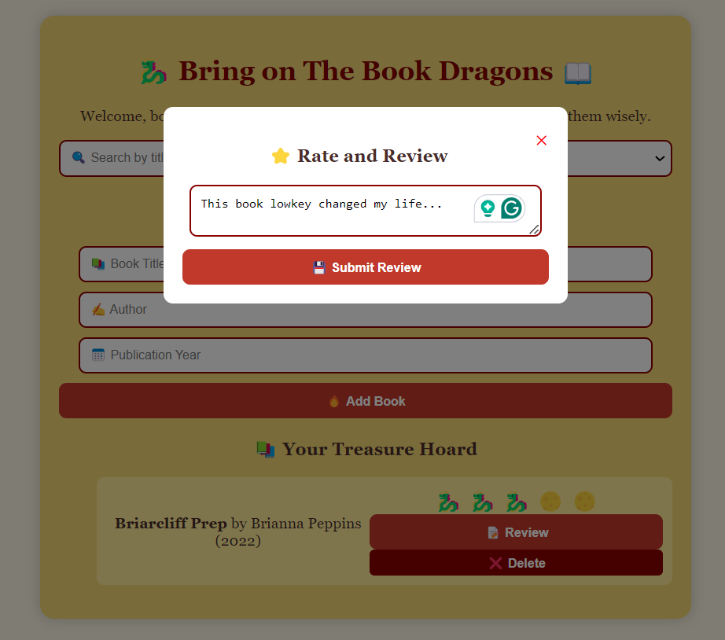

# 🐉 Bring on The Book Dragons 📚

## About Me 📜
Bring on The Book Dragons is a digital treasure hoard for book lovers who love collecting, organising, and rating their reads. Whether you’re a casual reader or a literary dragon guarding a massive book collection let your book dragon spirit shine!

## 🚀 Features
- 📖 **Add Books**: Easily add books to your collection.
- 🔍 **Search & Sort**: Find books by title author, and sort them as you like (for displaying purposes!).
- ✏️ **Edit & Delete**: Update or remove books from your hoard.
- ⭐ **Rate & Review**: Leave themed ratings and reviews for books.
- 💾 **Local Storage**: Your hoard is saved even if you refresh the page!

## 📸 Preview  
 

  

## 🛠 How to Use
1. 📚 Enter the book title, author, and publication year.
2. 🔥 Click the "Add Book" button to add it to your hoard.
3. 🧐 Use the search bar to find books or sort them as needed.
4. ✏️ Click "Details" to view more information.
5. ❌ Click "Delete" to remove a book from your collection.

## 🛠️ Tech Stack
- **HTML** 🏗️  
- **CSS** 🎨  
- **JavaScript** 🚀  